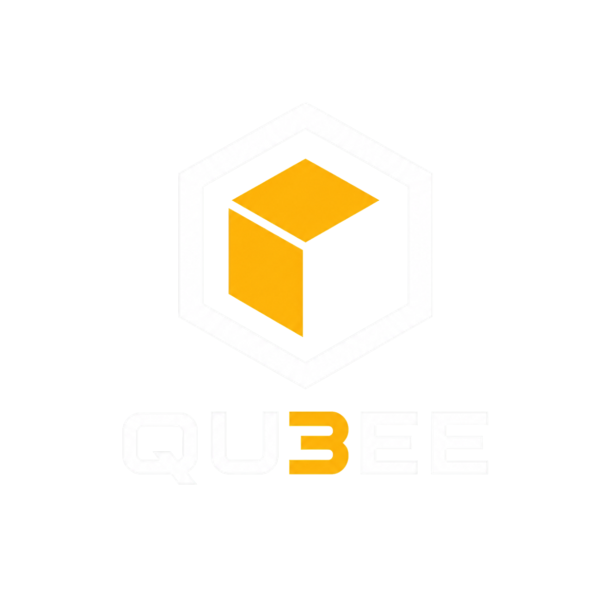

<a id="readme-top"></a>

<!-- Structure follows https://github.com/othneildrew/Best-README-Template -->

<br />
<div align="center">
  <a href="https://github.com/Scarce01/TOKEN-2049-">
    
  </a>

  <h1 align="center">Qu3ee</h1>

  <p align="center">
    A second line of defense for exchange withdrawals, enforced by Chainlink CRE and on-chain vaults.
    <br />
    <a href="docs/proposal_v4.md"><strong>Read the design »</strong></a>
    <br />
    <br />
    <a href="docs/SUBMISSION.md"><strong>Submission links</strong></a>
    &middot;
    <a href="docs/BENCHMARK.md">Benchmark report</a>
    &middot;
    <a href="docs/benchmark_whitepaper.html">Benchmark white paper (HTML)</a>
    &middot;
    <a href="docs/DEPLOY_BASE_SEPOLIA.md">Live on Base Sepolia</a>
    &middot;
    <a href="docs/STATUS.md">Status</a>
    &middot;
    <a href="docs/AUDIT_2026-10-07.md">Latest test and audit report</a>
    &middot;
    <a href="docs/TODO.md">To do</a>
    &middot;
    <a href="https://github.com/Scarce01/TOKEN-2049-/issues">Report an issue</a>
  </p>
</div>

<details>
  <summary>Table of contents</summary>
  <ol>
    <li>
      <a href="#about-the-project">About the project</a>
      <ul>
        <li><a href="#how-it-works">How it works</a></li>
        <li><a href="#results">Results</a></li>
        <li><a href="#built-with">Built with</a></li>
        <li><a href="#provenance">Provenance</a></li>
      </ul>
    </li>
    <li>
      <a href="#getting-started">Getting started</a>
      <ul>
        <li><a href="#prerequisites">Prerequisites</a></li>
        <li><a href="#installation">Installation</a></li>
      </ul>
    </li>
    <li><a href="#usage">Usage</a></li>
    <li><a href="#project-layout">Project layout</a></li>
    <li><a href="#roadmap">Roadmap</a></li>
    <li>
      <a href="#hackathon-tracks">Hackathon tracks</a>
      <ul>
        <li><a href="#main-track">Main track</a></li>
        <li><a href="#chainlink-cre">Chainlink CRE</a></li>
        <li><a href="#nownodes">NOWNodes</a></li>
        <li><a href="#solana">Solana</a></li>
        <li><a href="#cardano">Cardano</a></li>
        <li><a href="#still-to-add">Still to add</a></li>
      </ul>
    </li>
    <li><a href="#contributing">Contributing</a></li>
    <li><a href="#license">License</a></li>
    <li><a href="#contact">Contact</a></li>
    <li><a href="#acknowledgments">Acknowledgments</a></li>
  </ol>
</details>

## About the project


Most exchange thefts follow the same pattern: the attacker gains some control of the exchange, probes what is accepted,
and only then drains. Alerts usually live inside the same backend the attacker already controls.

Qu3ee moves the decision outside that trust boundary:

* **Decoys** (wallets, accounts, addresses) are planted inside the exchange. When an attacker touches one, the Chainlink
  CRE node network verifies it and tightens withdrawals on chain: warm vault frozen, hot quota zeroed, funds swept to
  cold, the attacker's receiver published to a shared ThreatRegistry. The exchange backend cannot undo any of it.
* A **prevention layer** checks every withdrawal against the user's own signed intent (seven gates in the Cosign
  workflow), keeps vaults transfer-only, rate-limits outflow with quota buckets, delays risky payouts instead of
  sending them to manual review, and reconciles assets every Patrol run.
* **Tracing**: an off-chain follower (Trek) proposes where the stolen money went next; CRE re-reads every proposed
  transfer and only then lists the next hop. Other member exchanges see the same list and hold payouts to it.

Naming: the product is **Qu3ee**. The code keeps its original prefix `Quorum` (contracts such as QuorumReceiver, the EIP-712 domains, CRE workflow names, database schemas), because renaming those would change signatures, workflow IDs and deployed addresses.

Design: [docs/proposal_v4.md](docs/proposal_v4.md). Build rules: [CLAUDE.md](CLAUDE.md). Interfaces:
[docs/10_interfaces.md](docs/10_interfaces.md). Where keys go: [docs/KEYS.md](docs/KEYS.md).

<p align="right">(<a href="#readme-top">back to top</a>)</p>

### How it works

| Path | Trigger | What CRE does | On chain |
| --- | --- | --- | --- |
| Trap | a decoy is touched (log trigger) | re-reads the receipt, cross-checks NOWNodes where available | confirmed pack: freeze, quota zero, sweep, alert 4, cold delay, THREAT |
| Cosign | every withdrawal request | seven gates + SPRT score, hidden cap by risk level | VERDICT: APPROVE (maybe delayed), PENDING or REJECT |
| Patrol | cron | ping, hidden threshold commit and reveal, quota refill, CUSUM, asset reconciliation | refills, checkpoints, tightening on drift |
| Patrol verify-edge | HTTP (Trek proposals) | verifies each traced transfer out of a listed suspect | derived THREAT (next hop) |

Every action is idempotent, every workflow is deterministic (integer math, anchor-block time), and the vaults only
obey the QuorumReceiver, which only obeys whitelisted workflows and two officers together.

### Results

Every number is tagged with its source: **on-chain** = public chain data, **assumed** = simulation or assumed
parameters, **test** = automated test, **testnet fork (local)** = local anvil fork of Base Sepolia driven by the CRE
CLI (`cre workflow simulate --broadcast`), **testnet fork (hosted)** = the anvil fork of Base Sepolia served at the public Observatory URL,
**testnet** = public Ethereum Sepolia, **testnet (DON)** = public Base Sepolia with the workflows running on the
Chainlink DON, **testnet (Solana devnet)** = the Solana program below.

#### Working

| Result | Number | Source |
| --- | --- | --- |
| **Live on the Chainlink DON** (public Base Sepolia, PROD contracts, real KeystoneForwarder) | Patrol, Trap and Cosign deployed; Patrol **52/52** reports accepted, cron tick to block 18 s; 7 DON transmitters ([deploy](docs/DEPLOY_BASE_SEPOLIA.md)) | testnet (DON) |
| Trap on the DON | decoy touch to on-chain freeze in **10 s** (5 blocks): alert 4, warm frozen, hot quota 0, attacker listed (1 run) | testnet (DON) |
| Cosign on the DON | withdrawal request to APPROVE on chain in **18 s** (9 blocks); paid 50 qUSD after the network-follow delay (1 run) | testnet (DON) |
| Spike rule (CUSUM + Shewhart) on the Bitget hot wallet | alarm at **18:58**, the minute of the first large theft; Bitget noticed at 19:05 | on-chain |
| Decoy touched to freeze, end to end | attacker probes, CRE trips, then alert 4, warm frozen, hot quota 0, receiver listed; **15 s** probe to freeze including about 14 s CLI compile | testnet fork (local) |
| Decoy hit on a public chain | recorded run on Ethereum Sepolia: NOWNodes confirmed the log, trap tripped, a later APPROVE reverted with `AlertConfirmed`; re-verified read-only | testnet |
| Prevention layer, 8 cases with the real CRE CLI | honest paid; forged REJECT; over-deposit PENDING; large-to-new shadow; passkey delayed then paid; user cancel; officer HOLD then two-officer cancel; over-cap delayed and paid by the keeper: **8/8** | testnet fork (local) |
| Network follow | while any confirmed threat is active, every member delays payouts by L1 (10 min); the keeper pays when due | testnet fork (local) |
| Tracing on chain | attacker launders two hops; Trek proposes, CRE verify-edge verifies, both hops listed with the evidence chain; forged and non-suspect edges refused; a payout to a traced address is PENDING (42): **11/11**; last hop to listed in **14 s** | testnet fork (local) |
| Contracts | **146** tests, including 5 invariants held over 262,144 random calls | test |
| CRE workflow logic | **84** tests; the same event twice gives byte-identical reports | test |
| Tracing from one seed address | Bybit: **51 of 51** FBI-listed addresses within 3 hops; Stake: **4 of 4** within 2 hops | on-chain |
| Decoy hit probability | formula 66.02% vs 100,000-run Monte Carlo 66.07% | assumed |
| Gate 7 false-pending on real withdrawals (Binance) | about **14 per 10,000** | on-chain (cap scaling assumed) |
| Quota bucket vs the Bitget theft | **6 of 7** theft transfers would go to the manual lane | on-chain (C multiplier assumed) |
| Design conformance (`pnpm verify:design`) | 83 items: **47 pass**, 1 fail (D28), 34 not yet (acceptance scenes not written), 1 waived | test |
| **Solana Guard** (devnet, hackathon work) | qUSD-S, a Token-2022 mint with the Qu3ee transfer hook: transfer **SUCCESS** before, Guard set to CONTAINED from the DON's Base Sepolia Trap report, the same transfer **REJECTED on chain** after; 16/16 program tests ([solana/README.md](solana/README.md), [evidence page](https://dist-two-gamma-80.vercel.app)) | testnet (Solana devnet) |
| Public fork Observatory | <https://da2whkz14p08x.cloudfront.net/>. Recorded attack on org A, blocks 47786511 to 47786515: decoy tripwire, CRE report, warm vault frozen, hot quota 0, alert CONFIRMED, threat shared. The verify line names the local fork, not a NOWNodes call | testnet fork (hosted) |

#### Not working yet

| Result | Number | Source | Why |
| --- | --- | --- | --- |
| **Decoys still distinguishable** (D28) | top-60 accounts: AUC 0.71 / 0.58, target <= 0.65 | assumed | 10 decoys only; generator may leak through activity features |
| **Quota bucket only helps in the first minutes** | fast-lane bound USD 16.9M vs USD 47.6M stolen by 19:05 | on-chain | an attacker who splits transfers is slowed, not stopped |
| **Tracing stops at some bridges** | Bitget: 8 to 12 of 14 attacker wallets from one seed with Across and Stargate decoded | on-chain | intent solvers, CCTP and Mayan not decoded yet |
| DON figures are single runs; frontend still on the fork | the other prevention cases ran on the local fork only; the Observatory reads the fork until it is switched | testnet (DON) | more runs and the frontend switch are in progress |
| Invariants do not cover the legitimate path | removing some vault checks is caught only by unit tests | test | ghost-variable checks still to add |

Full benchmark write-up (tracing, cross-chain, Trek, alarm rules, DON runs, limits, deployment plan):
[docs/BENCHMARK.md](docs/BENCHMARK.md). The same report as a designed page with charts:
[docs/benchmark_whitepaper.html](docs/benchmark_whitepaper.html) (download and open in a browser).

More detail and caveats: [docs/STATUS.md](docs/STATUS.md), [docs/AUDIT_2026-10-07.md](docs/AUDIT_2026-10-07.md),
[reports/design-conformance.md](reports/design-conformance.md).

<p align="right">(<a href="#readme-top">back to top</a>)</p>

### Built with

* [![Solidity][Solidity-badge]][Solidity-url] Foundry, OpenZeppelin v5
* [![Chainlink][Chainlink-badge]][Chainlink-url] CRE workflows in TypeScript (`@chainlink/cre-sdk`)
* [![TypeScript][TypeScript-badge]][TypeScript-url] [![Bun][Bun-badge]][Bun-url] viem, Hono, Ponder
* [![Next.js][Next-badge]][Next-url] Console and user app (wagmi, Tailwind, TanStack Query)
* [![Supabase][Supabase-badge]][Supabase-url] Postgres, pg-boss outbox
* [![Python][Python-badge]][Python-url] tracing analysis and Trek
* NOWNodes (Trap second source, and the cross-chain tracing RPC), Base Sepolia and Ethereum Sepolia
* Solana, Anchor, Token-2022 transfer hook on devnet ([solana/README.md](solana/README.md))

<p align="right">(<a href="#readme-top">back to top</a>)</p>

### Provenance

This codebase was started before TOKEN2049 Origins in the team's private beta repository
(`Scarce01/TOKEN-2049-beta`) and was imported into this repository as a single commit on 2026-10-07. The full commit
history of the beta repository is available to the organizers on request. The same import brought in the team's
earlier design notes ([docs/background](docs/background)) and two earlier UI drafts ([archive](archive)); the live UI is
[apps/observatory](apps/observatory).

The Solana Guard program under [solana/](solana/) was written during the hackathon on 2026-10-07. It is not part of
that import.

<p align="right">(<a href="#readme-top">back to top</a>)</p>

## Getting started

### Prerequisites

* Node 20+, [pnpm](https://pnpm.io), [Bun](https://bun.sh) 1.2.21+, Python 3.11+
* [Foundry](https://book.getfoundry.sh) (`forge`, `anvil`, `cast`)
* [CRE CLI](https://docs.chain.link/cre) logged in (`cre whoami`)
* Optional: Supabase CLI for the database

### Installation

1. Install dependencies and run the tests
   ```sh
   pnpm install
   cd contracts && forge install OpenZeppelin/openzeppelin-contracts@v5.4.0 foundry-rs/forge-std --no-git && forge test
   cd ../workflows && bun install && bun test
   ```
2. Copy every `.env.example` to `.env` and fill it in as described in [docs/KEYS.md](docs/KEYS.md). Never commit
   `.env` files, `secrets/`, private keys or service keys.
3. Database (optional for the chain demos): `supabase db push --db-url "$SUPABASE_DB_URL" --include-seed`

<p align="right">(<a href="#readme-top">back to top</a>)</p>

## Usage

**Public Base Sepolia (live)**: contracts in PROD mode, Patrol, Trap and Cosign on the Chainlink DON. Addresses,
workflow IDs and how it was deployed: [docs/DEPLOY_BASE_SEPOLIA.md](docs/DEPLOY_BASE_SEPOLIA.md). Which `.env` holds
what: [docs/ENV.md](docs/ENV.md).

**Public fork Observatory**: <https://da2whkz14p08x.cloudfront.net/> serves the Observatory against an anvil fork of
Base Sepolia (chain id 84532, mode SIM). It is not the PROD deployment above. A completed attack is at
`/bridge/attack/status`. On the run recorded 2026-10-07, org A moved from block 47786511 to 47786515. The second-source
line on that run is the local fork: a public node cannot see the fork transaction, and NOWNodes is not called.

**Solana devnet**: recorded program id, mint, and the before, contain, and after transactions are in
[solana/README.md](solana/README.md). Evidence page: <https://dist-two-gamma-80.vercel.app>. The fork Observatory does
not embed that run.

```sh
bun packages/offchain/scripts/e2e-cosign-public.ts   # one honest withdrawal, verdict written by the DON
python analysis/don_bench/don_benchmark.py           # DON executions joined with on-chain reports
```

**Simulation chain** (local anvil fork of Base Sepolia, the setup the team uses):

```sh
anvil --fork-url https://sepolia.base.org --gas-limit 100000000 --state .tmp/fork-state.json
bash scripts/deploy.sh base-sepolia-fork      # any *-fork name always deploys to 127.0.0.1:8545
bun packages/offchain/scripts/e2e-prevention.ts   # 8 prevention cases through the CRE CLI (E2E_ORG=b for org B)
pnpm demo:trace                               # decoy hit -> freeze -> Trek -> CRE verify-edge -> traced payout held
```

**Live demo UI** (the observatory on http://localhost:8443, reading the fork):

```sh
bun scripts/round3-pg.ts                                   # exchange database (PGlite, 127.0.0.1:54329)
bun packages/offchain/scripts/fork-demo/setup.ts           # once per fork deployment: hot wallets, decoy, configs
bun --env-file=apps/exchange-api/.env.fork apps/exchange-api/src/index.ts   # exchange backend, 127.0.0.1:8797
bun packages/offchain/scripts/fork-demo/bridge.ts          # Attack button and Patrol scheduler, 127.0.0.1:8790
python analysis/decoygen/serve.py --org a --tick 30 --fresh # live decoy generation and inventory, 127.0.0.1:8791
cd apps/observatory && pnpm install --ignore-workspace && pnpm dev           # UI, http://localhost:8443
```

| Port | Service | Source |
| --- | --- | --- |
| 8545 | anvil fork of Base Sepolia | `anvil` |
| 54329 | exchange database | `scripts/round3-pg.ts` |
| 8797 | exchange backend (untrusted) | `apps/exchange-api` |
| 8790 | bridge: Attack flow and Patrol through the CRE CLI | `packages/offchain/scripts/fork-demo/bridge.ts` |
| 8791 | decoy generator, live mode: inventory, SSE events (tags only, off-chain plan) | `analysis/decoygen/serve.py` ([docs/48](docs/48_decoy_generation.md)) |
| 42069 | indexer: chain events and state snapshots as time series, SSE (`/history`) | `services/indexer` ([docs/49](docs/49_visualization_data.md)) |
| 8443 | observatory UI | `apps/observatory` (`VITE_RPC_URL`, `VITE_BRIDGE_URL` override 8545 and 8790) |

**Single workflow runs:**

```sh
cd workflows
cre workflow simulate ./patrol -T fork-settings --non-interactive --trigger-index 0 --broadcast
cre workflow simulate ./trap -T fork-settings --non-interactive --trigger-index 0 \
  --evm-tx-hash <tx> --evm-event-index <log> --broadcast
```

**Checks:**

```sh
pnpm test                 # every workspace
pnpm verify:design        # design conformance report in reports/design-conformance.md
```

Mode B (no DON deployment access): `services/sim-runner` turns chain events into `cre workflow simulate --broadcast`
calls (Trap before Patrol before Cosign). Production limits stay on.

<p align="right">(<a href="#readme-top">back to top</a>)</p>

## Project layout

| Path | What |
| --- | --- |
| `contracts/` | Foundry: QuorumReceiver, vaults, RequestBoard, KeyRegistry, DepositVault, ThreatRegistry, ConfigTimelock, OfficerDesk, Lens |
| `workflows/` | CRE workflows `trap`, `cosign`, `patrol` (incl. verify-edge), `demo-approve` (demo only); decision logic in `src/logic` as pure functions |
| `packages/shared` | IDs, EIP-712, report codec, deterministic seal, ABIs |
| `packages/offchain` | shared off-chain helpers and the fork E2E |
| `packages/verify` | `pnpm verify:design`, database permission tests, static checks |
| `apps/exchange-api` | fake exchange backend (untrusted; forwards only) |
| `apps/observatory` | live demo UI (Vite, React, three.js), port 8443; its 3D map is `hexmap.html` at the repo root. Installs outside the pnpm workspace |
| `apps/console`, `apps/user-app` | officer console and user wallet app (Next.js) |
| `services/` | indexer (Ponder), trap-sync, sim-runner, keeper, notifier, decoy-admin, redteam (attacker scanner and demos) |
| `analysis/` | tracing backtests, Trek, decoy and risk analysis |
| `datasets/`, `supabase/` | synthetic data and chain seeding; migrations and seed |
| `packages/offchain/scripts/fork-demo` | fork demo setup, bridge (Attack flow, Patrol scheduler) |
| `docs/background`, `archive/` | earlier design notes and UI drafts, kept for reference |
| `solana/` | Qu3ee Guard, a Token-2022 transfer hook on Solana devnet. Written during the hackathon. [solana/README.md](solana/README.md) |

<p align="right">(<a href="#readme-top">back to top</a>)</p>

## Roadmap

- [x] Contracts, three CRE workflows, prevention layer (seven gates, delays, HOLD, user cancel, passkeys, key recovery)
- [x] Decoy trap to on-chain tightening, network sharing, NOWNodes second source
- [x] Tracing on chain: Trek proposals verified by CRE verify-edge
- [x] End-to-end runs on the simulation chain with the CRE CLI
- [ ] Acceptance scenes for the 34 open design items (see [docs/TODO.md](docs/TODO.md))
- [x] Public Base Sepolia deployment, mode A: Patrol, Trap and Cosign live on the Chainlink DON
- [x] Solana Guard on devnet ([solana/README.md](solana/README.md))
- [ ] Frontend and indexer switched to the public deployment. The hosted Observatory still reads the fork
- [ ] Cardano agentic commerce. x402 on Preprod is in `services/trace-market`. A published payment transaction and Masumi are not
- [ ] AWS deployment ([docs/38_phase8_aws.md](docs/38_phase8_aws.md)): CDK, ECS Fargate, Amplify, CloudWatch. The public URL above is the fork host, not that stack
- [ ] Team decisions: decoy indistinguishability (D28), R7 lane under freeze, decoy rotation

Full list: [docs/TODO.md](docs/TODO.md). Open decisions: [docs/STATUS.md](docs/STATUS.md) under 待决定.

<p align="right">(<a href="#readme-top">back to top</a>)</p>

## Hackathon tracks

One product, scored separately below. A box is checked only when this repository, or a public link named here, already
shows that thing. Numbers come from the [Results](#results) table.

### Main track

| Weight | Criterion | Where Qu3ee stands |
| --- | --- | --- |
| 30% | Functionality and execution. Does it work, and can the team show the journeys end to end? | DON path on public Base Sepolia: decoy touch to freeze, Cosign request to APPROVE, Patrol reports. Fork path: prevention 8/8, tracing 11/11, and the hosted Observatory attack above. Solana path: transfer allowed, then rejected on chain after containment. **Missing:** a demo video URL. |
| 25% | Technical implementation and integration. Blockchain, contracts, protocols, APIs, and how the pieces are orchestrated. | Solidity vaults obey only `QuorumReceiver`. CRE workflows `trap`, `cosign`, and `patrol` orchestrate chain reads, HTTP, and `writeReport`. Trap calls NOWNodes. Trek proposals enter Patrol verify-edge over HTTP. The Solana hook enforces the Guard PDA on every Token-2022 transfer. |
| 20% | Innovation and originality. A new idea, or a new use of existing technology, where Web3 is necessary. | The exchange backend cannot loosen a tightening. The decision sits in CRE and the contracts. Member exchanges share one ThreatRegistry. Tracing does not trust the follower: CRE re-reads each proposed transfer. The same confirmed threat then fails a transfer inside a Solana token hook. |
| 15% | Usefulness and potential impact. A real problem, and a path past the hackathon. | The problem is exchange-key theft (Bybit, Stake, Bitget in [Results](#results)). The same receiver and workflows can sit in front of another custody hot wallet. **Missing:** no production exchange is running it. |
| 10% | Demo and presentation. A clear showing of what was built, how it works, and why the approach matters. | Hosted fork UI, Base Sepolia transactions in [docs/DEPLOY_BASE_SEPOLIA.md](docs/DEPLOY_BASE_SEPOLIA.md), Solana evidence page, this README, and [docs/proposal_v4.md](docs/proposal_v4.md). **Missing:** the demo video URL. |

### Chainlink CRE

Track challenge: connect a blockchain to an API, enterprise system, data source, LLM, or agent, with a CRE workflow as
the orchestration layer. Show a successful `cre workflow simulate` or a live CRE network deployment.

**To qualify**

- [x] CRE workflows are the orchestration layer: `workflows/trap`, `workflows/cosign`, `workflows/patrol` (including verify-edge). Handlers read chain state and HTTP, then `writeReport`. Decision logic is pure functions under each workflow's `src/logic`.
- [x] At least one chain is tied to an external system. Base Sepolia and Ethereum Sepolia. External calls: NOWNodes `eth_getTransactionReceipt` from Trap (`workflows/trap/workflow.ts`), and Trek proposals over HTTP into Patrol verify-edge. No LLM is wired in. The rubric allows any one of API, system, data source, LLM, or agent.
- [x] Successful CRE CLI simulation. Commands are in [Usage](#usage). Fork rows in [Results](#results) are those runs.
- [x] Live deployment on the CRE network. Patrol, Trap, and Cosign are ACTIVE on the DON, private registry. Workflow IDs, the KeystoneForwarder, and the PROD contract addresses are in [docs/DEPLOY_BASE_SEPOLIA.md](docs/DEPLOY_BASE_SEPOLIA.md). Patrol `002d793802489c6c0b8e379240bd9f8f7b6189ba682c02f19969e31fcaeb5078`, Trap `006576bb13bfa082e9ccf563521e2004534f708992cf597054db84be8ff3cd66`, Cosign `00e143e0e4721b04f2eb4f7d07274a5307c82c66d2d0d45a3fa110258bcb0ebc`.

**How this track is judged**

| Weight | Criterion | Where Qu3ee stands |
| --- | --- | --- |
| 40% | Blockchain. Value for decentralization and adoption. | Withdrawal policy is enforced by contracts a compromised exchange admin cannot call around. ThreatRegistry is readable by every member in the same deployment. The Solana hook is a second chain enforcing the same containment. |
| 40% | Effective use of CRE. How CRE is used. | CRE is the writer of freeze, quota, sweep, verdict, and threat reports. Reports are idempotent and deterministic (anchor-block time, integer math). The DON runs are the public Base Sepolia rows in [Results](#results). |
| 20% | Wow factor. | One confirmed Trap report on Base Sepolia is what moves the Solana Guard from NORMAL to CONTAINED. Subjective. |

### NOWNodes

Track challenge: a working Web3 product that uses NOWNodes RPC or API as part of the product, not a pasted URL.

**To qualify**

- [x] A NOWNodes endpoint is part of the product. Trap's second source is `https://eth-sepolia.nownodes.io` (`workflows/trap/src/logic/nownodes.ts`). The API key is the CRE secret `NOWNODES_KEY`, sent as the `api-key` header. The key is not in git.
- [x] The same key is the RPC for the Bitget cross-chain backtest: Arbitrum, Optimism, Base, BSC, and Avalanche C-Chain (`analysis/trace_bybit/cases/bitget.json`, called from `analysis/trace_bybit/xchain.py`). Ethereum in that backtest is read through Etherscan, not NOWNodes. Solana devnet does not use NOWNodes.
- [x] Working prototype. The Ethereum Sepolia qualification run is in [Results](#results): NOWNodes confirmed the log, the trap tripped, and a later APPROVE reverted with `AlertConfirmed`.
- [x] Meaningful use. Before a confirmed tightening, Trap re-reads the transaction receipt from NOWNodes and compares the log. A contradicting receipt stops the report (design D48). An unavailable NOWNodes response does not veto, so a dead second source cannot block a real hit.
- [x] Where it sits. CRE HTTP client, only inside Trap, only when `nownodesRpcUrl` is set. `nownodesUrlFor(84532)` is empty, so Base Sepolia and the public fork do not call NOWNodes. The fork attack log says the second source is the local fork for that reason. Tracing calls NOWNodes only for the origin chains listed above.
- [ ] Account proof a judge can see (dashboard or a redacted key id). The secret name is in `workflows/secrets.yaml`. The account itself is outside the repo.
- [ ] Hackathon form fields (track checkbox, links) are not stored in this README.

**How this track is judged**

| Weight | Criterion | Where Qu3ee stands |
| --- | --- | --- |
| 25% | Quality and completeness. End-to-end flow, stable enough to demo, coherent architecture. | Trap to vault is covered by the fork demo, the DON freeze, and `workflows/trap/test/nownodes.test.ts`. |
| 25% | Use of NOWNodes. Important to the architecture, not a decorative RPC. | The second source can stop a tightening when it contradicts the CRE log. The cross-chain backtest uses it to follow bridge deposits on five origin chains. It is not used for ordinary Base Sepolia reads. |
| 20% | Real-world usefulness. | Aimed at exchange custody. Same limit as the main track: no production exchange yet. |
| 15% | Technical creativity. | Consensus text for the receipt is canonicalized (sorted logs, integer status) so CRE nodes agree. |
| 15% | Scalability and further development. | One receipt call per decoy hit on chains that have an endpoint. Adding a chain is a new URL in `NOWNODES_URL`, not a new workflow. |

### Solana

[Qu3ee Solana Guard](solana/README.md) is in this repo under `solana/programs/qu3ee_guard`. It was written on 2026-10-07.
The EVM work it reacts to is the earlier import, disclosed under [Provenance](#provenance).

qUSD-S is a Token-2022 mint. Every transfer calls the Guard hook, which reads that mint's Guard PDA. `NORMAL` allows
the transfer. `CONTAINED` fails it on chain (`GuardError::Contained`). `set_guard_contained` applies a confirmed Qu3ee
threat. The recorded run used the Chainlink DON's Trap report on Base Sepolia: KeystoneForwarder accepted it, and the
Receiver logged FREEZE and THREAT, before the Guard moved. Same case twice does not change state. Older evidence
cannot override newer state. One Guard is per org and mint.

| | |
| --- | --- |
| Cluster | devnet |
| Program | [`HaJ4J8KhE5FGfBFpgrwkqXk6yXfdjNYJpLjJ71KGrEXz`](https://explorer.solana.com/address/HaJ4J8KhE5FGfBFpgrwkqXk6yXfdjNYJpLjJ71KGrEXz?cluster=devnet) |
| qUSD-S mint | [`6D7PygkF5K85JS1Cbkxvz6J4Q7vrY1byCLx47T3w91o6`](https://explorer.solana.com/address/6D7PygkF5K85JS1Cbkxvz6J4Q7vrY1byCLx47T3w91o6?cluster=devnet) |
| Transfer before containment | [SUCCESS](https://explorer.solana.com/tx/2NBywAz97EinV7i7aBWAWsQai2Y3nQZDDMFEFb5KeHBTjviNhyrqTpcqLfXFBEtcjfjb561VkUJJscthF39qY4w6?cluster=devnet) |
| Guard set to CONTAINED | [tx](https://explorer.solana.com/tx/xcKtP7Q4xsZmNPQXMHKvE1EqttUVuFvYeUEbLjp6r5N4tiCZqAXv49LqiNLyufYacAkP1jp5tQyRNrYrAMC1weU?cluster=devnet), evidence [Base Sepolia](https://sepolia.basescan.org/tx/0x32ab0635fff14b905027e50d102d71feb25e66383ca40b536b9405a9da1b834f) |
| Same transfer after | [REJECTED on chain](https://explorer.solana.com/tx/2jhbFKJ9uWVgTJbsxnB9WCxWGuVcUsQi1oMabuC1u5BWMusP4cfTFYykhJSs9RdrfGw22w9GjrEGDXqmR5vHwkZd?cluster=devnet) |

Full run: [demo/solana-latest-run.json](demo/solana-latest-run.json). Every transaction:
[demo/solana-history.json](demo/solana-history.json). Evidence page:
<https://dist-two-gamma-80.vercel.app>. The before-transfer signature was `finalized` on devnet when this section was
written. Same links: [docs/SUBMISSION.md](docs/SUBMISSION.md).

**To qualify**

- [x] The project interacts with Solana through a program deployed for this hackathon: `solana/programs/qu3ee_guard` (`initialize_guard`, `set_guard_contained`, transfer hook `execute`).
- [x] It works on devnet. Program id and cluster are in the table above.
- [x] At least one explorer transaction. The table has the successful transfer, the containment, and the rejected transfer.
- [x] Solana code written during the hackathon, and the imported EVM work is disclosed.
- [x] Public repository. A judge can open the evidence page and the explorer links without asking the team.
- [ ] Re-running `pnpm solana:demo` needs the gitignored devnet keys in `secrets/solana/`. The recorded run does not. `pnpm solana:test` is 16 tests on a local validator.

**How this track is judged**

| Weight | Criterion | Where Qu3ee stands |
| --- | --- | --- |
| 30% | Technical execution on Solana. Core logic on-chain scores higher than a product that only touches the chain. | The allow and the reject happen inside the transfer hook. 16 program tests (S01 to S08) cover authority, idempotency, and org isolation. CRE does not yet write the Guard itself: the receiver instruction is still open ([solana/README.md](solana/README.md)). |
| 20% | Innovation and originality. | Containment is a token-level failure, triggered by a threat that was confirmed on another chain. |
| 20% | Product and user experience, including onboarding and wallet flow. | The judge-facing demo is the evidence page and the explorer links. There is no wallet-connect flow in the Observatory. |
| 15% | Real-world impact and a plausible path to users. | Same custody problem as the main track. A production mint would need the DON, not a local key, as the Guard authority. |
| 15% | Demo and presentation. A live demo counts for more than slides. | Evidence page and explorer links are live. **Missing:** the demo video URL. |

### Cardano

In progress. After CRE and NOWNodes confirm a threat, a deeper trace can be a service QUBEE does not run itself.
`services/trace-market` is that purchase. The Trace Agent serves `GET /api/trace/:address` and answers with HTTP 402.
The terms are 1 tADA on `cardano:preprod`, paid to a Preprod address. `@x402/cardano` and the Cardano Foundation
facilitator verify and settle it. The agent holds no key. The Investigator reads the 402, applies the spend policy
(up to 1 tADA automatically, up to 10 tADA only for a CONFIRMED case, above that a human approves, BEHAVIOR never
pays), signs through Koios Preprod, and retries. HTTP 200 returns the existing Bybit, Bitget, and Stake replay for
that address. Payment does not change a classification, and Cardano does not decide whether the Ethereum attack is
real. Masumi escrow, refunds, and agent identity are not in this repo. No Preprod payment transaction is committed.
`pnpm cardano:investigate` writes `apps/observatory/src/data/cardano_x402.json`. The Observatory card stays empty
until that file exists. Docs: [services/trace-market/README.md](services/trace-market/README.md) and
[docs/51_track_cardano.md](docs/51_track_cardano.md).

To run it past this hackathon, put the Trace Agent on public HTTPS and keep each Investigator on its own capped
wallet. Mainnet is the same route with the network, facilitator, and asset changed together.

**To qualify**

- [x] A prototype on Cardano Preprod: the Trace Agent and the Investigator in `services/trace-market`.
- [x] Documentation for that prototype, including the problem, the x402 and Preprod tools, and how it would be deployed.
- [ ] A payment transaction a judge can open. The explorer link appears only after `pnpm cardano:investigate`.
- [ ] A demo video of at most 3 minutes.

The brief also points at Masumi for escrow, refunds, disputes, agent identity, and an on-chain registry. That layer
is not built. Direct x402 is the path in the tree.

**How this track would be judged, once a prototype exists**

| Weight | Criterion |
| --- | --- |
| 30% | Technical execution and use of Cardano tech (Masumi, EUTXO, native tokens, smart contracts). Does the demo work, and can the code grow? |
| 20% | Innovation and creativity, including whether it moves agentic commerce on Cardano. |
| 20% | User experience and design, including onboarding for someone new to the chain. |
| 20% | Impact and feasibility past the hackathon. |
| 10% | Pitch and presentation. |

### Still to add

| Track | Add this |
| --- | --- |
| Main, Chainlink, NOWNodes, Solana, Cardano | Demo video URL. Cardano caps it at 3 minutes. |
| NOWNodes | Proof the NOWNodes account is real. The public fork does not call NOWNodes, so a judge should be shown the Ethereum Sepolia run, not only the hosted Observatory. |
| Solana | Optional, for the UX score: a wallet flow. Optional, for the next step already noted in `solana/README.md`: CRE writes the Guard, so the authority is the DON rather than a key. |
| Cardano | A Preprod payment transaction a judge can open, the 3 minute video, and Masumi if you want that part of the brief. |
| All | Hackathon submission form: track checkboxes and the links above. |

<p align="right">(<a href="#readme-top">back to top</a>)</p>

## Contributing

The team works through pull requests; see [docs/TEAM_WORKFLOW.md](docs/TEAM_WORKFLOW.md).

1. Run `/sync` (or `node scripts/team/sync.mjs`) at the start of every session
2. Create a branch (`git checkout -b feat/your-change`)
3. Change interfaces in [docs/10_interfaces.md](docs/10_interfaces.md) first; contract changes start with a forge test
4. Run `pnpm test` and `pnpm verify:design --phase N` for the phase you touched
5. Commit, push the branch and open a pull request; use `/handoff` when your change affects someone else's area

Rules that never bend: the exchange backend holds no decision logic, the decoy list never reaches git, logs, frontends
or exchange schemas, and every number in the UI or the video names its source.

### Top contributors

<a href="https://github.com/Scarce01/TOKEN-2049-/graphs/contributors">
  
</a>

An avatar shows up once your commit email is linked to your GitHub account (GitHub, Settings, Emails), or when you
commit with your GitHub noreply address.

<p align="right">(<a href="#readme-top">back to top</a>)</p>

## License

No license has been chosen yet; until then all rights are reserved by the team.

<p align="right">(<a href="#readme-top">back to top</a>)</p>

## Contact

Team board and issues: [github.com/Scarce01/TOKEN-2049-/issues](https://github.com/Scarce01/TOKEN-2049-/issues)

Project link: [github.com/Scarce01/TOKEN-2049-](https://github.com/Scarce01/TOKEN-2049-)

<p align="right">(<a href="#readme-top">back to top</a>)</p>

## Acknowledgments

* [Chainlink CRE](https://docs.chain.link/cre) for the workflow runtime and CLI
* [NOWNodes](https://nownodes.io) for the second data source
* [OpenZeppelin](https://www.openzeppelin.com/contracts), [Foundry](https://book.getfoundry.sh), [viem](https://viem.sh), [Ponder](https://ponder.sh), [Supabase](https://supabase.com)
* Public incident data: FBI PSA I-022625-PSA (Bybit), public on-chain data via BigQuery and Etherscan
* [Best-README-Template](https://github.com/othneildrew/Best-README-Template)

<p align="right">(<a href="#readme-top">back to top</a>)</p>

<!-- MARKDOWN LINKS & IMAGES -->
[Solidity-badge]: https://img.shields.io/badge/Solidity-0.8.24-363636?style=for-the-badge&logo=solidity&logoColor=white
[Solidity-url]: https://soliditylang.org
[Chainlink-badge]: https://img.shields.io/badge/Chainlink-CRE-375BD2?style=for-the-badge&logo=chainlink&logoColor=white
[Chainlink-url]: https://docs.chain.link/cre
[TypeScript-badge]: https://img.shields.io/badge/TypeScript-3178C6?style=for-the-badge&logo=typescript&logoColor=white
[TypeScript-url]: https://www.typescriptlang.org
[Bun-badge]: https://img.shields.io/badge/Bun-000000?style=for-the-badge&logo=bun&logoColor=white
[Bun-url]: https://bun.sh
[Next-badge]: https://img.shields.io/badge/Next.js-000000?style=for-the-badge&logo=nextdotjs&logoColor=white
[Next-url]: https://nextjs.org
[Supabase-badge]: https://img.shields.io/badge/Supabase-3FCF8E?style=for-the-badge&logo=supabase&logoColor=white
[Supabase-url]: https://supabase.com
[Python-badge]: https://img.shields.io/badge/Python-3776AB?style=for-the-badge&logo=python&logoColor=white
[Python-url]: https://www.python.org
