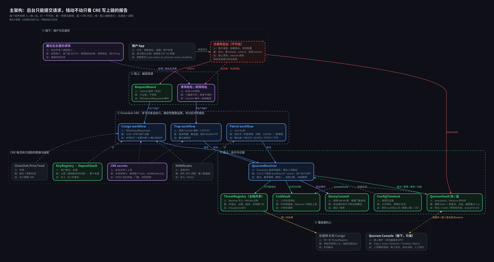

<a id="readme-top"></a>

<!-- Structure follows https://github.com/othneildrew/Best-README-Template -->

<br />
<div align="center">
  <h1 align="center">QUBEE (beta)</h1>

  <p align="center">
    A second line of defense for exchange withdrawals, enforced by Chainlink CRE and on-chain vaults.
    <br />
    <a href="docs/proposal_v4.md"><strong>Read the design »</strong></a>
    <br />
    <br />
    <a href="docs/BENCHMARK.md">Benchmark report</a>
    &middot;
    <a href="docs/STATUS.md">Status</a>
    &middot;
    <a href="docs/AUDIT_2026-10-07.md">Latest test and audit report</a>
    &middot;
    <a href="docs/TODO.md">To do</a>
    &middot;
    <a href="https://github.com/Scarce01/TOKEN-2049-beta/issues">Report an issue</a>
  </p>
</div>

<details>
  <summary>Table of contents</summary>
  <ol>
    <li>
      <a href="#about-the-project">About the project</a>
      <ul>
        <li><a href="#how-it-works">How it works</a></li>
        <li><a href="#results">Results</a></li>
        <li><a href="#built-with">Built with</a></li>
        <li><a href="#provenance">Provenance</a></li>
      </ul>
    </li>
    <li>
      <a href="#getting-started">Getting started</a>
      <ul>
        <li><a href="#prerequisites">Prerequisites</a></li>
        <li><a href="#installation">Installation</a></li>
      </ul>
    </li>
    <li><a href="#usage">Usage</a></li>
    <li><a href="#project-layout">Project layout</a></li>
    <li><a href="#roadmap">Roadmap</a></li>
    <li><a href="#contributing">Contributing</a></li>
    <li><a href="#license">License</a></li>
    <li><a href="#contact">Contact</a></li>
    <li><a href="#acknowledgments">Acknowledgments</a></li>
  </ol>
</details>

## About the project



Most exchange thefts follow the same pattern: the attacker gains some control of the exchange, probes what is accepted,
and only then drains. Alerts usually live inside the same backend the attacker already controls.

QUBEE moves the decision outside that trust boundary:

* **Decoys** (wallets, accounts, addresses) are planted inside the exchange. When an attacker touches one, the Chainlink
  CRE node network verifies it and tightens withdrawals on chain: warm vault frozen, hot quota zeroed, funds swept to
  cold, the attacker's receiver published to a shared ThreatRegistry. The exchange backend cannot undo any of it.
* A **prevention layer** checks every withdrawal against the user's own signed intent (seven gates in the Cosign
  workflow), keeps vaults transfer-only, rate-limits outflow with quota buckets, delays risky payouts instead of
  sending them to manual review, and reconciles assets every Patrol run.
* **Tracing**: an off-chain follower (Trek) proposes where the stolen money went next; CRE re-reads every proposed
  transfer and only then lists the next hop. Other member exchanges see the same list and hold payouts to it.

Design: [docs/proposal_v4.md](docs/proposal_v4.md). Build rules: [CLAUDE.md](CLAUDE.md). Interfaces:
[docs/10_interfaces.md](docs/10_interfaces.md). Where keys go: [docs/KEYS.md](docs/KEYS.md).

<p align="right">(<a href="#readme-top">back to top</a>)</p>

### How it works

| Path | Trigger | What CRE does | On chain |
| --- | --- | --- | --- |
| Trap | a decoy is touched (log trigger) | re-reads the receipt, cross-checks NOWNodes where available | confirmed pack: freeze, quota zero, sweep, alert 4, cold delay, THREAT |
| Cosign | every withdrawal request | seven gates + SPRT score, hidden cap by risk level | VERDICT: APPROVE (maybe delayed), PENDING or REJECT |
| Patrol | cron | ping, hidden threshold commit and reveal, quota refill, CUSUM, asset reconciliation | refills, checkpoints, tightening on drift |
| Patrol verify-edge | HTTP (Trek proposals) | verifies each traced transfer out of a listed suspect | derived THREAT (next hop) |

Every action is idempotent, every workflow is deterministic (integer math, anchor-block time), and the vaults only
obey the QuorumReceiver, which only obeys whitelisted workflows and two officers together.

### Results

Every number is tagged with its source: **on-chain** = public chain data, **assumed** = simulation or assumed
parameters, **test** = automated test, **testnet fork (local)** = local anvil fork of Base Sepolia driven by the CRE
CLI (`cre workflow simulate --broadcast`), **testnet** = public Ethereum Sepolia.

#### Working

| Result | Number | Source |
| --- | --- | --- |
| Decoy touched to freeze, end to end | attacker probes, CRE trips, then alert 4, warm frozen, hot quota 0, receiver listed; **15 s** probe to freeze including about 14 s CLI compile | testnet fork (local) |
| Decoy hit on a public chain | recorded run on Ethereum Sepolia: NOWNodes confirmed the log, trap tripped, a later APPROVE reverted with `AlertConfirmed`; re-verified read-only | testnet |
| Prevention layer, 8 cases with the real CRE CLI | honest paid; forged REJECT; over-deposit PENDING; large-to-new shadow; passkey delayed then paid; user cancel; officer HOLD then two-officer cancel; over-cap delayed and paid by the keeper: **8/8** | testnet fork (local) |
| Network follow | while any confirmed threat is active, every member delays payouts by L1 (10 min); the keeper pays when due | testnet fork (local) |
| Tracing on chain | attacker launders two hops; Trek proposes, CRE verify-edge verifies, both hops listed with the evidence chain; forged and non-suspect edges refused; a payout to a traced address is PENDING (42): **11/11**; last hop to listed in **14 s** | testnet fork (local) |
| Contracts | **146** tests, including 5 invariants held over 262,144 random calls | test |
| CRE workflow logic | **84** tests; the same event twice gives byte-identical reports | test |
| Tracing from one seed address | Bybit: **51 of 51** FBI-listed addresses within 3 hops; Stake: **4 of 4** within 2 hops | on-chain |
| Decoy hit probability | formula 66.02% vs 100,000-run Monte Carlo 66.07% | assumed |
| Gate 7 false-pending on real withdrawals (Binance) | about **14 per 10,000** | on-chain (cap scaling assumed) |
| Quota bucket vs the Bitget theft | **6 of 7** theft transfers would go to the manual lane | on-chain (C multiplier assumed) |
| Design conformance (`pnpm verify:design`) | 83 items: **47 pass**, 1 fail (D28), 34 not yet (acceptance scenes not written), 1 waived | test |

#### Not working yet

| Result | Number | Source | Why |
| --- | --- | --- | --- |
| **Decoys still distinguishable** (D28) | top-60 accounts: AUC 0.71 / 0.58, target <= 0.65 | assumed | 10 decoys only; generator may leak through activity features |
| **CUSUM misses the Bitget drain** | no alarm after the hack at any threshold | on-chain | a few huge transfers over 2.5 hours never accumulate |
| **Quota bucket only helps in the first minutes** | fast-lane bound USD 16.9M vs USD 47.6M stolen by 19:05 | on-chain | an attacker who splits transfers is slowed, not stopped |
| **Tracing stops at bridges** | Bitget: 8 of 14 attacker wallets from one seed | on-chain | cross-chain matching not built |
| No public Base Sepolia or DON run | everything above ran on a local fork, plus one Ethereum Sepolia run | testnet fork (local) | needs a funded deployer and a CRE deployment decision |
| Invariants do not cover the legitimate path | removing some vault checks is caught only by unit tests | test | ghost-variable checks still to add |

Full benchmark write-up (tracing, cross-chain, Trek, alarm rules, limits, deployment plan): [docs/BENCHMARK.md](docs/BENCHMARK.md).

More detail and caveats: [docs/STATUS.md](docs/STATUS.md), [docs/AUDIT_2026-10-07.md](docs/AUDIT_2026-10-07.md),
[reports/design-conformance.md](reports/design-conformance.md).

<p align="right">(<a href="#readme-top">back to top</a>)</p>

### Built with

* [![Solidity][Solidity-badge]][Solidity-url] Foundry, OpenZeppelin v5
* [![Chainlink][Chainlink-badge]][Chainlink-url] CRE workflows in TypeScript (`@chainlink/cre-sdk`)
* [![TypeScript][TypeScript-badge]][TypeScript-url] [![Bun][Bun-badge]][Bun-url] viem, Hono, Ponder
* [![Next.js][Next-badge]][Next-url] Console and user app (wagmi, Tailwind, TanStack Query)
* [![Supabase][Supabase-badge]][Supabase-url] Postgres, pg-boss outbox
* [![Python][Python-badge]][Python-url] tracing analysis and Trek
* NOWNodes (second data source), Base Sepolia and Ethereum Sepolia

<p align="right">(<a href="#readme-top">back to top</a>)</p>

### Provenance

This codebase was started before TOKEN2049 Origins in the team's private beta repository
(`Scarce01/TOKEN-2049-beta`) and was imported into this repository as a single commit on 2026-10-07. The full commit
history of the beta repository is available to the organizers on request. The same import brought in the team's
earlier design notes ([docs/background](docs/background)) and two earlier UI drafts ([archive](archive)); the live UI is
[apps/observatory](apps/observatory).

<p align="right">(<a href="#readme-top">back to top</a>)</p>

## Getting started

### Prerequisites

* Node 20+, [pnpm](https://pnpm.io), [Bun](https://bun.sh) 1.2.21+, Python 3.11+
* [Foundry](https://book.getfoundry.sh) (`forge`, `anvil`, `cast`)
* [CRE CLI](https://docs.chain.link/cre) logged in (`cre whoami`)
* Optional: Supabase CLI for the database

### Installation

1. Install dependencies and run the tests
   ```sh
   pnpm install
   cd contracts && forge install OpenZeppelin/openzeppelin-contracts@v5.4.0 foundry-rs/forge-std --no-git && forge test
   cd ../workflows && bun install && bun test
   ```
2. Copy every `.env.example` to `.env` and fill it in as described in [docs/KEYS.md](docs/KEYS.md). Never commit
   `.env` files, `secrets/`, private keys or service keys.
3. Database (optional for the chain demos): `supabase db push --db-url "$SUPABASE_DB_URL" --include-seed`

<p align="right">(<a href="#readme-top">back to top</a>)</p>

## Usage

**Simulation chain** (local anvil fork of Base Sepolia, the setup the team uses):

```sh
anvil --fork-url https://sepolia.base.org --gas-limit 100000000 --state .tmp/fork-state.json
bash scripts/deploy.sh base-sepolia-fork      # any *-fork name always deploys to 127.0.0.1:8545
bun packages/offchain/scripts/e2e-prevention.ts   # 8 prevention cases through the CRE CLI (E2E_ORG=b for org B)
pnpm demo:trace                               # decoy hit -> freeze -> Trek -> CRE verify-edge -> traced payout held
```

**Live demo UI** (the observatory on http://localhost:8443, reading the fork):

```sh
bun scripts/round3-pg.ts                                   # exchange database (PGlite, 127.0.0.1:54329)
bun packages/offchain/scripts/fork-demo/setup.ts           # once per fork deployment: hot wallets, decoy, configs
bun --env-file=apps/exchange-api/.env.fork apps/exchange-api/src/index.ts   # exchange backend, 127.0.0.1:8797
bun packages/offchain/scripts/fork-demo/bridge.ts          # Attack button and Patrol scheduler, 127.0.0.1:8790
python analysis/decoygen/serve.py --org a --tick 30 --fresh # live decoy generation and inventory, 127.0.0.1:8791
cd apps/observatory && pnpm install --ignore-workspace && pnpm dev           # UI, http://localhost:8443
```

| Port | Service | Source |
| --- | --- | --- |
| 8545 | anvil fork of Base Sepolia | `anvil` |
| 54329 | exchange database | `scripts/round3-pg.ts` |
| 8797 | exchange backend (untrusted) | `apps/exchange-api` |
| 8790 | bridge: Attack flow and Patrol through the CRE CLI | `packages/offchain/scripts/fork-demo/bridge.ts` |
| 8791 | decoy generator, live mode: inventory, SSE events (tags only, off-chain plan) | `analysis/decoygen/serve.py` ([docs/48](docs/48_decoy_generation.md)) |
| 8443 | observatory UI | `apps/observatory` (`VITE_RPC_URL`, `VITE_BRIDGE_URL` override 8545 and 8790) |

**Single workflow runs:**

```sh
cd workflows
cre workflow simulate ./patrol -T fork-settings --non-interactive --trigger-index 0 --broadcast
cre workflow simulate ./trap -T fork-settings --non-interactive --trigger-index 0 \
  --evm-tx-hash <tx> --evm-event-index <log> --broadcast
```

**Checks:**

```sh
pnpm test                 # every workspace
pnpm verify:design        # design conformance report in reports/design-conformance.md
```

Mode B (no DON deployment access): `services/sim-runner` turns chain events into `cre workflow simulate --broadcast`
calls (Trap before Patrol before Cosign). Production limits stay on.

<p align="right">(<a href="#readme-top">back to top</a>)</p>

## Project layout

| Path | What |
| --- | --- |
| `contracts/` | Foundry: QuorumReceiver, vaults, RequestBoard, KeyRegistry, DepositVault, ThreatRegistry, ConfigTimelock, OfficerDesk, Lens |
| `workflows/` | CRE workflows `trap`, `cosign`, `patrol` (incl. verify-edge), `demo-approve` (demo only); decision logic in `src/logic` as pure functions |
| `packages/shared` | IDs, EIP-712, report codec, deterministic seal, ABIs |
| `packages/offchain` | shared off-chain helpers and the fork E2E |
| `packages/verify` | `pnpm verify:design`, database permission tests, static checks |
| `apps/exchange-api` | fake exchange backend (untrusted; forwards only) |
| `apps/observatory` | live demo UI (Vite, React, three.js), port 8443; its 3D map is `hexmap.html` at the repo root. Installs outside the pnpm workspace |
| `apps/console`, `apps/user-app` | officer console and user wallet app (Next.js) |
| `services/` | indexer (Ponder), trap-sync, sim-runner, keeper, notifier, decoy-admin, redteam (attacker scanner and demos) |
| `analysis/` | tracing backtests, Trek, decoy and risk analysis |
| `datasets/`, `supabase/` | synthetic data and chain seeding; migrations and seed |
| `packages/offchain/scripts/fork-demo` | fork demo setup, bridge (Attack flow, Patrol scheduler) |
| `docs/background`, `archive/` | earlier design notes and UI drafts, kept for reference |

<p align="right">(<a href="#readme-top">back to top</a>)</p>

## Roadmap

- [x] Contracts, three CRE workflows, prevention layer (seven gates, delays, HOLD, user cancel, passkeys, key recovery)
- [x] Decoy trap to on-chain tightening, network sharing, NOWNodes second source
- [x] Tracing on chain: Trek proposals verified by CRE verify-edge
- [x] End-to-end runs on the simulation chain with the CRE CLI
- [ ] Acceptance scenes for the 34 open design items (see [docs/TODO.md](docs/TODO.md))
- [ ] Public Base Sepolia deployment and CRE mode decision (DON or sim-runner)
- [ ] AWS deployment ([docs/38_phase8_aws.md](docs/38_phase8_aws.md)): CDK, ECS Fargate, Amplify, CloudWatch
- [ ] Team decisions: decoy indistinguishability (D28), R7 lane under freeze, decoy rotation

Full list: [docs/TODO.md](docs/TODO.md). Open decisions: [docs/STATUS.md](docs/STATUS.md) under 待决定.

<p align="right">(<a href="#readme-top">back to top</a>)</p>

## Contributing

The team works through pull requests; see [docs/TEAM_WORKFLOW.md](docs/TEAM_WORKFLOW.md).

1. Run `/sync` (or `node scripts/team/sync.mjs`) at the start of every session
2. Create a branch (`git checkout -b feat/your-change`)
3. Change interfaces in [docs/10_interfaces.md](docs/10_interfaces.md) first; contract changes start with a forge test
4. Run `pnpm test` and `pnpm verify:design --phase N` for the phase you touched
5. Commit, push the branch and open a pull request; use `/handoff` when your change affects someone else's area

Rules that never bend: the exchange backend holds no decision logic, the decoy list never reaches git, logs, frontends
or exchange schemas, and every number in the UI or the video names its source.

<p align="right">(<a href="#readme-top">back to top</a>)</p>

## License

No license has been chosen yet; until then all rights are reserved by the team.

<p align="right">(<a href="#readme-top">back to top</a>)</p>

## Contact

Team board and issues: [github.com/Scarce01/TOKEN-2049-beta/issues](https://github.com/Scarce01/TOKEN-2049-beta/issues)

Project link: [github.com/Scarce01/TOKEN-2049-beta](https://github.com/Scarce01/TOKEN-2049-beta)

<p align="right">(<a href="#readme-top">back to top</a>)</p>

## Acknowledgments

* [Chainlink CRE](https://docs.chain.link/cre) for the workflow runtime and CLI
* [NOWNodes](https://nownodes.io) for the second data source
* [OpenZeppelin](https://www.openzeppelin.com/contracts), [Foundry](https://book.getfoundry.sh), [viem](https://viem.sh), [Ponder](https://ponder.sh), [Supabase](https://supabase.com)
* Public incident data: FBI PSA I-022625-PSA (Bybit), public on-chain data via BigQuery and Etherscan
* [Best-README-Template](https://github.com/othneildrew/Best-README-Template)

<p align="right">(<a href="#readme-top">back to top</a>)</p>

<!-- MARKDOWN LINKS & IMAGES -->
[Solidity-badge]: https://img.shields.io/badge/Solidity-0.8.24-363636?style=for-the-badge&logo=solidity&logoColor=white
[Solidity-url]: https://soliditylang.org
[Chainlink-badge]: https://img.shields.io/badge/Chainlink-CRE-375BD2?style=for-the-badge&logo=chainlink&logoColor=white
[Chainlink-url]: https://docs.chain.link/cre
[TypeScript-badge]: https://img.shields.io/badge/TypeScript-3178C6?style=for-the-badge&logo=typescript&logoColor=white
[TypeScript-url]: https://www.typescriptlang.org
[Bun-badge]: https://img.shields.io/badge/Bun-000000?style=for-the-badge&logo=bun&logoColor=white
[Bun-url]: https://bun.sh
[Next-badge]: https://img.shields.io/badge/Next.js-000000?style=for-the-badge&logo=nextdotjs&logoColor=white
[Next-url]: https://nextjs.org
[Supabase-badge]: https://img.shields.io/badge/Supabase-3FCF8E?style=for-the-badge&logo=supabase&logoColor=white
[Supabase-url]: https://supabase.com
[Python-badge]: https://img.shields.io/badge/Python-3776AB?style=for-the-badge&logo=python&logoColor=white
[Python-url]: https://www.python.org
